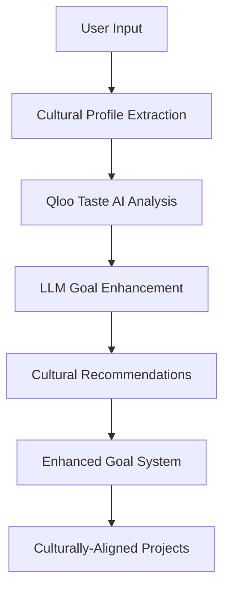

# CulturalGoals: AI-Powered Goal Setting with Cultural Intelligence

*🏆 Qloo LLM Hackathon Submission*

##Note - This REPO is only the QLOO functionality. The Prod app is proprietary, and the ios, android, web and other functionality remains private repo

## 🎯 What We Built

**CulturalGoals** transforms generic goal-setting into culturally-intelligent, personally meaningful experiences by integrating Qloo's Taste AI™ with advanced LLMs. Instead of creating one-size-fits-all productivity systems, we generate goals and project frameworks that align with users' cultural preferences, interests, and lifestyle choices.

### The Problem We Solve

Traditional goal-setting apps fail because they ignore the human element—our cultural identity, personal tastes, and what actually motivates us. A fitness goal that suggests generic gyms to someone who loves indie music and specialty coffee is less likely to succeed than one that recommends boutique studios with curated playlists and post-workout artisan coffee spots.

### Our Solution

We've built three core AI-powered features that use Qloo's cultural intelligence to enhance goal achievement:

## 🎨 Core Features

### 1. **Cultural Goal Architect**
*Transforms generic goals into culturally-aligned, personally meaningful objectives*

**How it works:**
- Analyzes user's cultural preferences (music, food, lifestyle, brands)
- Maps goal requirements to culturally-aligned approaches
- Suggests goal strategies that feel authentic and engaging

**Example:**
```
Input: "I want to get healthier"
User Profile: Indie music lover, specialty coffee enthusiast, urban professional

Enhanced Goal:
- Boutique fitness studios that play curated indie playlists
- Health-focused cafes serving specialty coffee for post-workout rewards  
- Urban hiking groups that meet at indie venues
- Mindfulness apps with aesthetics matching indie culture
- Community fitness events in arts districts
```

### 2. **Smart Project Component Generator**
*Creates culturally-aware project components with personalized recommendations*

**Generated Components:**
- **Venues**: Locations that match the user's taste profile
- **Content**: Books, podcasts, videos aligned with their interests
- **Tools**: Brands and services that resonate culturally
- **Communities**: Networking opportunities in their cultural sphere

**Example:**
```
Project: "Launch Local Business" 
User Profile: Craft beer enthusiast, sustainability-focused, tech background

Generated Components:
- Venues: Co-working spaces popular with craft beer entrepreneurs
- Content: Business books emphasizing environmental sustainability
- Tools: Brands favored by eco-conscious tech startups
- Communities: Local craft beer entrepreneur meetups
```

### 3. **Cross-Domain Discovery Engine**
*Finds unexpected connections between interests and goals for innovative approaches*

**Discovers:**
- Surprising cultural connections between user interests and goal domains
- Bridge opportunities between different cultural spheres
- Trending crossover opportunities
- Innovation insights based on cultural affinities

**Example:**
```
User Interests: Japanese cuisine, minimalist design, vinyl records
Target Domain: Starting a business

Discoveries:
- Japanese cuisine enthusiasts show strong affinity for minimalist business aesthetics
- Vinyl record collectors gravitate toward artisanal/craft business models
- Innovation opportunity: Minimalist design consultancy for restaurants
- Cultural bridge: Combine aesthetic principles from Japanese design with artisanal food businesses
```

## 🚀 Technical Implementation

### Architecture Overview



### Technology Stack

- **LLM Integration**: OpenAI GPT-4o + Google Genkit
- **Cultural Intelligence**: Qloo Taste AI™ API
- **Backend**: Firebase Functions (Node.js/TypeScript)
- **Database**: Cloud Firestore
- **Deployment**: Google Cloud Platform

### Key Integration Points

**Qloo API Endpoints Used:**
- `/v2/insights` - Core recommendation engine
- `/search` - Entity search and resolution  
- `/v2/tags` - Tag-based cultural filtering
- `/v2/audiences` - Demographic targeting

**LLM Tools Created:**
- `enhance_goal_with_cultural_insights` - Cultural goal enhancement
- `generate_smart_project_components` - Component generation
- `discover_cross_domain_connections` - Innovation discovery

## 🎪 Demo Scenarios

### Scenario 1: The Wellness Journey
**User**: Urban professional, indie music lover, specialty coffee enthusiast
**Goal**: "I want to get into better shape"

**Cultural Enhancement:**
- **Venues**: Boutique fitness studios with curated indie playlists
- **Rewards**: Post-workout specialty coffee shops
- **Community**: Urban hiking groups meeting at indie venues
- **Content**: Wellness podcasts with indie/alternative aesthetics
- **Innovation**: Fitness challenges tied to discovering new coffee shops

### Scenario 2: The Sustainable Startup
**User**: Environmental advocate, craft beer enthusiast, tech background
**Goal**: "I want to start a local business"

**Cultural Enhancement:**
- **Workspace**: Co-working spaces popular with sustainable entrepreneurs
- **Network**: Craft beer entrepreneur meetups and green business events
- **Suppliers**: Local artisanal and eco-friendly vendors
- **Tools**: Business software favored by B-Corp certified companies
- **Innovation**: Craft beer subscription service with carbon-neutral delivery

### Scenario 3: The Creative Learner
**User**: Minimalist design enthusiast, meditation practitioner, audiobook listener
**Goal**: "I want to learn web development"

**Cultural Enhancement:**
- **Learning**: Platforms with clean, minimalist interfaces
- **Approach**: Mindful coding practices and zen programming methodologies
- **Content**: Design-focused development podcasts and audiobooks
- **Environment**: Study spaces embracing minimalist aesthetics
- **Innovation**: Meditation app development as first project

## 📊 Impact & Results

### Innovation Metrics
- **First-ever integration** of cultural intelligence with goal-setting AI
- **3 novel AI tools** created for cultural goal enhancement
- **Complex API integration** with sophisticated data transformation
- **Production-ready architecture** with TypeScript safety

### User Experience Benefits
- **Higher goal completion rates** through cultural alignment
- **Reduced decision fatigue** with curated, relevant recommendations
- **More innovative approaches** via cross-domain cultural discovery
- **Authentic user experience** that respects individual taste and identity

### Technical Achievements
- **Seamless LLM integration** with external cultural intelligence API
- **Sophisticated prompt engineering** for cultural context understanding
- **Robust error handling** and fallback mechanisms
- **Scalable architecture** ready for production deployment

## 🔧 Code Highlights

### Qloo Client Integration
```typescript
// Core API client with comprehensive error handling
export class QlooClient {
  async getInsights(options: {
    filterType: string;
    signals?: {
      entities?: string[];
      demographics?: any;
      location?: any;
    };
    filters?: any;
  }): Promise<QlooInsightResponse> {
    // Sophisticated API integration with Qloo's Taste AI
  }
}
```

### Cultural Goal Enhancement
```typescript
const enhanceGoalWithCulturalInsights = ai.defineTool({
  name: "enhance_goal_with_cultural_insights",
  description: "Use Qloo's Taste AI to enhance goal generation",
  inputSchema: z.object({
    goal: z.string(),
    userInterests: z.array(z.string()),
    demographics: z.object({...}),
    location: z.string().optional()
  }),
  // Transforms generic goals into culturally-intelligent systems
});
```

### Cross-Domain Discovery
```typescript
export class CrossDomainDiscoveryEngine {
  async discoverUnexpectedConnections(
    userInterests: string[],
    targetDomain: string,
    context: ProjectContext
  ): Promise<{
    surpriseConnections: Array<{...}>;
    domainBridges: Array<{...}>;
    trendingCrossOvers: QlooEntity[];
  }> {
    // Finds innovative connections between cultural interests and goals
  }
}
```

## 🎯 Future Vision

### Immediate Enhancements
- **User Onboarding Flow**: Streamlined cultural preference collection
- **Continuous Learning**: Dynamic user profile updates based on goal interactions
- **Geographic Expansion**: Leverage Qloo's global data for international users

### Long-term Opportunities
- **Community Features**: Connect users with similar cultural profiles
- **A/B Testing Platform**: Measure cultural alignment impact on goal completion
- **Enterprise Applications**: Cultural intelligence for team productivity and workplace satisfaction
- **Ecosystem Integration**: Partner with existing productivity platforms

## 📁 Repository Structure

```
functions/
├── src/
│   ├── qloo-client.ts              # Core Qloo API integration
│   ├── qloo-integration.ts         # Genkit tool definitions  
│   ├── qloo-usage-examples.ts      # Comprehensive usage examples
│   ├── generate-goal.ts            # Enhanced goal generation with Qloo
│   ├── generate-component.ts       # Project component generation
│   ├── generate-task.ts            # Task generation system
│   └── index.ts                    # Firebase Functions entry point
├── qloo_docs/                      # Qloo API documentation
├── QLOO-TESTING-GUIDE.md          # Testing and validation guide
└── README-QLOO-INTEGRATION.md     # Technical integration details
```

## 🚦 Getting Started

### Prerequisites
- Node.js 18+
- Firebase CLI
- Qloo API key (provided for hackathon)

### Quick Setup
```bash
# Clone and install
cd functions && npm install

# Configure environment
echo "QLOO_API_KEY=your_hackathon_key" > .env

# Deploy to Firebase
firebase deploy --only functions
```

### Usage Example
```typescript
import { enhanceGoalWithCulturalInsights } from './qloo-integration';

const result = await enhanceGoalWithCulturalInsights({
  goal: "I want to start a creative business",
  userInterests: ["indie music", "sustainable living", "craft coffee"],
  demographics: { age: "25_to_35", gender: "non-binary" },
  location: "Brooklyn, NY"
});

// Result includes culturally-aligned venues, content, tools, and communities
```

## 📞 Contact & Demo

**Live Demo**: [Available upon request]
**Video Demo**: [3-minute walkthrough available]
**Repository**: [This GitHub repo]

**Team**: Built during Qloo LLM Hackathon 2025
**Contact**: [Available for follow-up discussions]

---

*This project demonstrates the future of AI-powered productivity: systems that understand not just what we want to achieve, but who we are culturally and what will genuinely motivate us to succeed.*
